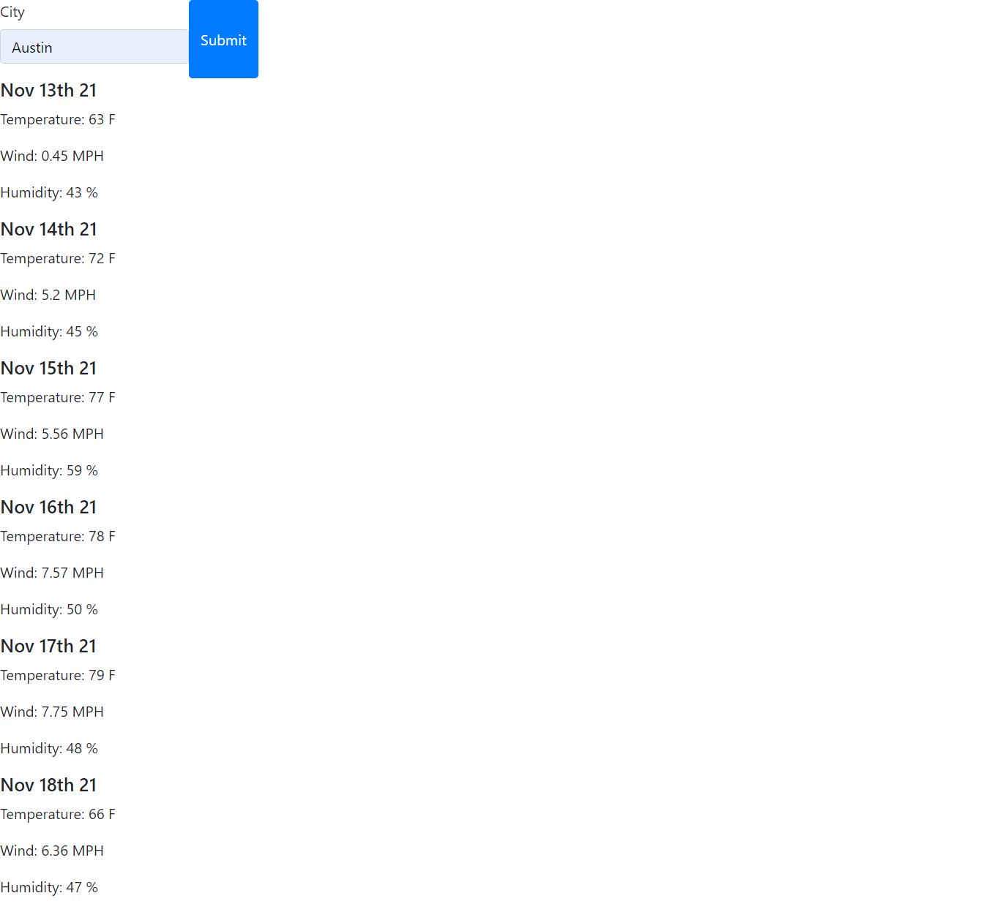

# Weather Dashboard

# For the Grader
* I forgot to clone the repo and did it locally.  
* In the image folder, you can find a screenshot of the local repository with date and time of edit and creation.
* Comming back to this one later to apply some styles.

## When:

* User input and submit is presented with current weather data and a 5 day forecast.

[Link Here!](https://yamcham0.github.io/Homework-06/)

